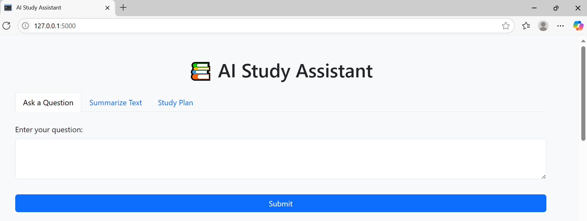

# 📚 AI Study Assistant

An intelligent study assistant powered by Google Gemini API and Flask. It can:

- 💬 Answer academic questions
- 📝 Summarize long notes
- 🗓️ Generate custom study plans

---

## ✨ Features

- **Ask a Question:** Get AI-generated answers to study-related queries.
- **Summarize Text:** Paste any paragraph and get a concise summary.
- **Create Study Plan:** Enter a subject and your available time (in hours or days), and receive a structured study plan.

---

## 🛠️ Tech Stack

| Layer      | Tools Used              |
|------------|-------------------------|
| Frontend   | HTML5, Bootstrap 5      |
| Backend    | Python, Flask           |
| AI Model   | Google Gemini 1.5 Flash |
| Deployment | Render                  |

---

## 📸 Screenshot



---

## 🔗 Live Demo

Check out the live app here: [AI Study Assistant Demo](https://your-deployment-link.com)


## 🧑‍💻 How to Run Locally

### 1. Clone the Repository

```bash
git clone https://github.com/AishaJalil/ai-study-assistant.git
cd ai-study-assistant
```
### 2. Create and Activate a Virtual Environment (Optional but Recommended)
```bash
python -m venv venv
```
source venv/bin/activate  # On Windows: venv\Scripts\activate

### 3. Install Dependencies
```bash
pip install -r requirements.txt
```
### 4. Set Up Your API Key

Create a .env file in the root of your project
then add this line in the file:
GEMINI_API_KEY=your_google_gemini_api_key

### 5. Run the Flask app
```bash
python app.py
```
Visit http://localhost:5000 in your browser.   

---

## 🤝 Contributing

Contributions, suggestions, and improvements are welcome! Feel free to fork the repo and submit a pull request.

## 🙏 Acknowledgements

- [Gemini API by Google](https://ai.google.dev/)
- [Flask](https://flask.palletsprojects.com/)
- [Bootstrap](https://getbootstrap.com/)


